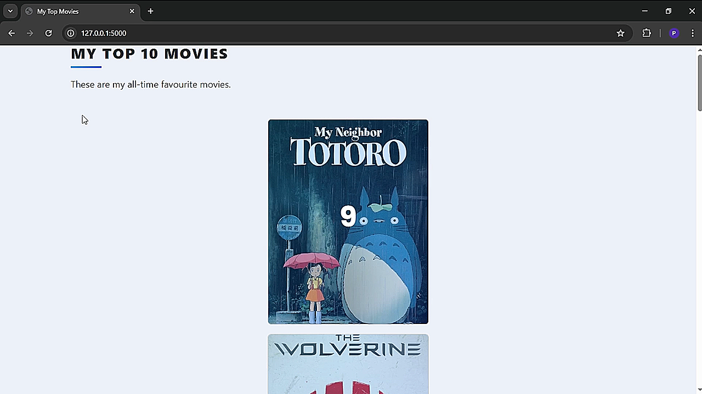

# My Top Movies
This is a Flask-based movie ranking app that allows users to manage their favorite movies in a database. Users can search for movies using an API, add them to their list with a rating and review, and update or delete them as needed. The app provides full CRUD functionality, ensuring seamless data management. Additionally, movies are displayed in a sorted list based on ranking, and the interface is styled with Bootstrap for a clean user experience.

## Video Demo
[](https://youtu.be/3VpU3Dfc3Yk)

## Author
Pranjal Sarnaik

## Features
- **Search movies via API** before adding.  
- **Add, update, and delete** movies in the database.  
- **Rate & review** movies after adding them.  
- **Sorted movie list** by ranking.  
- **Bootstrap UI** for a clean interface.  

## Level
Intermediate

## Tech Stack
Python | Flask | SQLAlchemy | WTForms | API Integration | Bootstrap | Web Development | Database Management

## How to Run
1. Clone the repo:  
   ```bash  
   git clone https://github.com/pranjalco/flask-my-top-10-movies.git

2. Install dependencies and run: 
    ```bash
   pip install -r requirements.txt
   pip install -r requirements_3.12.txt
   python main.py
   ```

**Created by Pranjal Sarnaik**  
*Released under the MIT License*